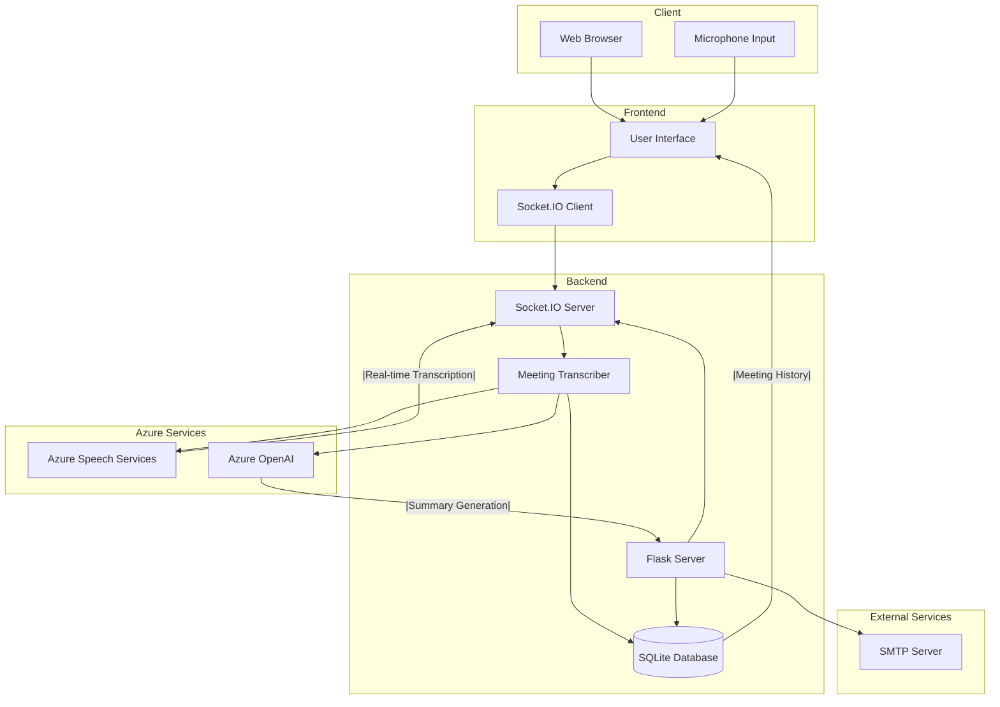

# Meeting Assistant Architecture

## System Architecture



## Component Details

### 1. Client Layer
- **Web Browser**: Modern web browser supporting WebSocket connections
- **Microphone Input**: User's microphone for speech input
- **User Interface**: HTML/CSS/JavaScript frontend for real-time interaction

### 2. Frontend Components
- **User Interface**
  - Real-time transcript display
  - Meeting controls (Start/End)
  - Summary display and editing
  - Email interface
- **Socket.IO Client**
  - Handles real-time communication
  - Manages WebSocket connections
  - Processes server events

### 3. Backend Components
- **Flask Server**
  - REST API endpoints
  - Request handling
  - Session management
- **Socket.IO Server**
  - Real-time event handling
  - WebSocket communication
  - Client-server synchronization
- **Meeting Transcriber**
  - Speech recognition management
  - Real-time transcription
  - Summary generation
- **SQLite Database**
  - Meeting history storage
  - Transcript persistence
  - Participant information

### 4. Azure Services
- **Azure Speech Services**
  - Real-time speech-to-text
  - Continuous recognition
  - Multiple language support
- **Azure OpenAI**
  - Meeting summary generation
  - Action item extraction
  - Natural language processing

### 5. External Services
- **SMTP Server**
  - Email delivery
  - Meeting summary distribution
  - Participant notifications

## Data Flow

1. **Meeting Start**
   ```
   User -> UI: Click "Start Meeting"
   UI -> Flask: POST /start_meeting
   Flask -> Transcriber: Initialize
   Transcriber -> Speech: Start Recognition
   ```

2. **Real-time Transcription**
   ```
   Mic -> Speech: Audio Stream
   Speech -> Transcriber: Text Results
   Transcriber -> SocketIO: Emit Update
   SocketIO -> UI: Display Text
   ```

3. **Meeting End**
   ```
   User -> UI: Click "End Meeting"
   UI -> Flask: POST /end_meeting
   Flask -> Transcriber: Stop Recording
   Transcriber -> OpenAI: Generate Summary
   OpenAI -> Flask: Return Summary
   Flask -> DB: Save Meeting
   Flask -> UI: Display Summary
   ```

4. **Email Distribution**
   ```
   User -> UI: Enter Emails
   UI -> Flask: POST /send_email
   Flask -> SMTP: Send Summary
   SMTP -> Participants: Deliver Email
   ```

## Security Considerations

1. **Authentication & Authorization**
   - API key management
   - Secure WebSocket connections
   - Environment variable protection

2. **Data Protection**
   - Encrypted communication
   - Secure storage
   - Access control

3. **Azure Security**
   - Managed identities
   - Key Vault integration
   - Network security

## Scalability

1. **Horizontal Scaling**
   - Stateless backend design
   - Load balancing support
   - Container orchestration ready

2. **Performance Optimization**
   - WebSocket for real-time updates
   - Efficient database queries
   - Caching strategies

## Monitoring

1. **Application Insights**
   - Performance metrics
   - Error tracking
   - Usage analytics

2. **Logging**
   - Application logs
   - Error logs
   - Audit trails 